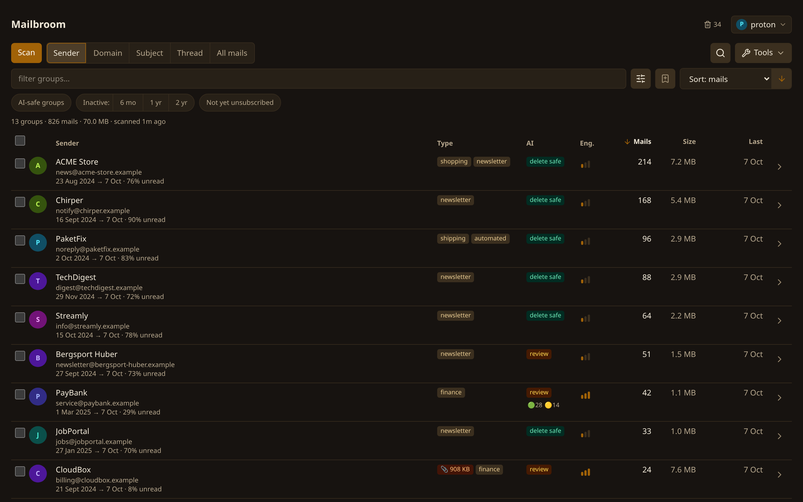
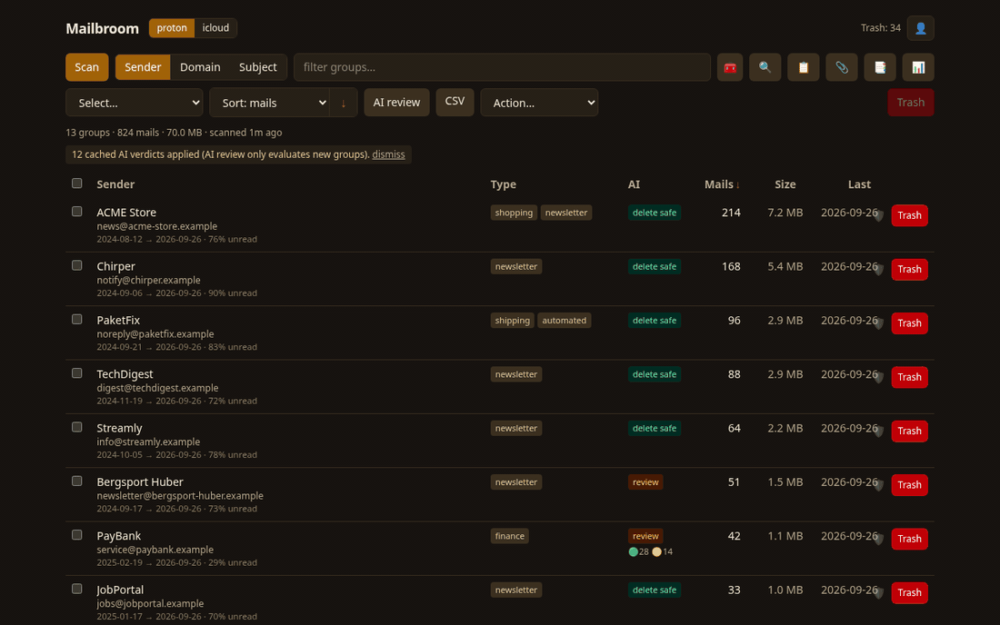
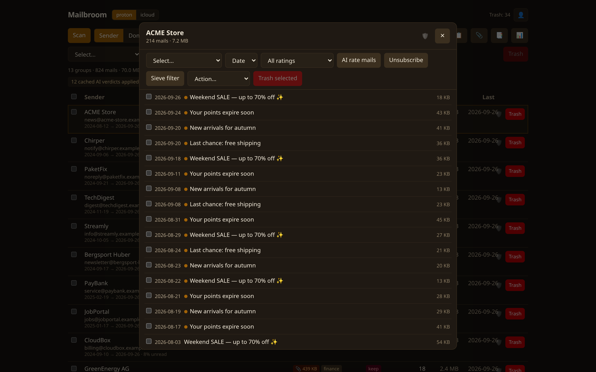
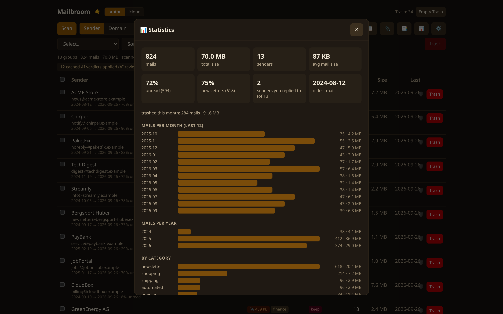
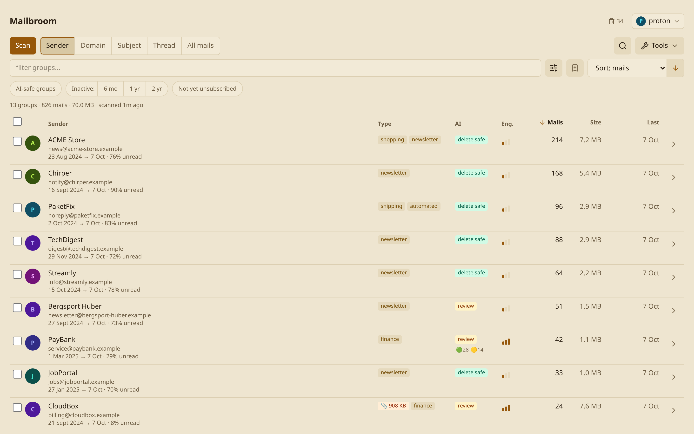

# Mailbroom

[](https://github.com/mclgoerg/mailbroom/actions/workflows/ci.yml)
[](https://github.com/mclgoerg/mailbroom/releases)
[](https://scorecard.dev/viewer/?uri=github.com/mclgoerg/mailbroom)
[](https://www.bestpractices.dev/projects/14997)
[](LICENSE)

**Tired of cleaning up your mailbox? Grab the broom.** 🧹

Mailbroom sweeps any IMAP mailbox - built with love for
[Proton Mail Bridge](https://proton.me/mail/bridge).

Declutter a mailbox: scan everything over IMAP, group mails **by
sender, domain, or subject** with counts, sizes, and unread ratios, drill
into any group down to the full mail text, and move whole groups or single
mails to Trash - with optional AI assistance (Anthropic API or Microsoft
Foundry) that suggests what's safe to delete and tracks its own cost.



**In action** - click a filter together, select everything the AI rated
safe, drill into a group:



<details>
<summary>More screenshots - drill-down, statistics, light theme</summary>





</details>

All screenshots show generated demo data (`scripts/demo.py` - run it
yourself for a zero-setup playground on fake mailboxes; the GIF rig is
`scripts/demo-gif.mjs`).

## Supported providers

Mailbroom speaks plain IMAP: special folders (Trash, Sent, Spam, …) are
detected via SPECIAL-USE flags (RFC 6154) with a name fallback, Gmail's
virtual "All Mail" is excluded automatically (no double counting), and
servers without the `MOVE` capability get a COPY+EXPUNGE fallback. The
settings dialog has a preset for each provider below that prefills
host/port/security - you only add a user + password, except Gmail and
Outlook which connect via OAuth instead (see below the table):

| Preset | IMAP host | SMTP host (unsubscribe) | Auth notes |
|---|---|---|---|
| **Proton Mail Bridge** | `127.0.0.1:1143` SSL | `127.0.0.1:1025` | Featured setup, see below. Paid Proton plan; use the Bridge-generated password and the exported Bridge certificate as CA file. |
| **Gmail** | `imap.gmail.com:993` SSL | `smtp.gmail.com:465` SSL | OAuth only in the settings UI - see below. |
| **Outlook / Microsoft 365** | `outlook.office365.com:993` SSL | `smtp.office365.com:587` STARTTLS | OAuth only in the settings UI - see below. |
| **iCloud Mail** | `imap.mail.me.com:993` SSL | `smtp.mail.me.com:587` STARTTLS | [App-specific password](https://account.apple.com/account/manage) required. |
| **Fastmail** | `imap.fastmail.com:993` SSL | `smtp.fastmail.com:465` SSL | [App password](https://www.fastmail.help/hc/en-us/articles/360058752854) with IMAP scope. |
| **GMX** | `imap.gmx.net:993` SSL | `mail.gmx.net:465` SSL | Enable IMAP in GMX mail settings first; app password if 2FA is on. |
| **mailbox.org** | `imap.mailbox.org:993` SSL | `smtp.mailbox.org:465` SSL | Normal password (or an app password). |
| **Yahoo Mail** | `imap.mail.yahoo.com:993` SSL | `smtp.mail.yahoo.com:465` SSL | [App password](https://help.yahoo.com/kb/SLN15241.html) required. |
| **Custom** | anything | anything | Any IMAP server with SSL or STARTTLS (Dovecot, Courier, …). |

**OAuth (Gmail / Outlook).** Both presets connect via OAuth only - no
password field is offered for them. If this server has a shared
Microsoft app configured, Outlook needs no setup at all: click Connect,
then enter the code shown at microsoft.com/devicelogin on any device.
Otherwise (and always for Gmail, which has no shared-client option -
Google requires per-app verification for the restricted mail scope),
you register your own free OAuth client first - see
[docs/install.md](docs/install.md#gmail-oauth-setup) for the Gmail
walkthrough and the Microsoft OAuth section for Entra ID. Outlook
support is experimental (fake-tested only, pending confirmation from a
real Microsoft 365 account - Gmail has been verified against a real
mailbox). The Sieve filter export is Proton-only and hidden for other
presets.

## Features

- **Three group views** - by sender, by domain (catches `noreply@`,
  `news@`, … of the same company), by normalized subject (merges
  `Order 123` / `Order 456`, strips Re:/Fwd:).
- **Cleanup signals** - mail count, total size (find attachment hogs),
  unread percentage, first→last date range, category tags (shipping,
  finance, shopping, social, travel, newsletters, automated…).
- **Drill-down** - every mail of a group with date/size/unread, full-text
  reader (HTML mails rendered as plain text - no remote content, no
  tracking pixels), per-mail selection and deletion.
- **AI review (optional)** - coarse verdicts per group
  (delete-safe/review/keep) and a fine-grained mode that rates every mail
  *inside* a group, with selection by rating. Verdicts are cached (by group
  key and Message-ID), so rescans and reopened groups cost nothing. Sends
  only metadata (addresses, counts, subject lines) - never mail bodies.
  Providers: Anthropic API, OpenAI, Claude on Microsoft Foundry, or any
  OpenAI-compatible local endpoint (Ollama, LM Studio, vLLM). Token usage
  and cost are tracked with a built-in price table.
- **Attachment explorer** - an on-demand BODYSTRUCTURE pass (structure
  only, no content downloaded) lists mails by attachment size with file
  names, adds a 📎 aggregate to groups, and enables the `att:>10m` filter.
  Proton IMAP can't strip single attachments, so cleanup means deleting
  the whole mail (reversible as always).
- **Statistics** - mails-per-year histogram, top domains by size, scan
  history and per-month cleanup tallies ("freed this month"), persisted
  across restarts.
- **Duplicate finder** - mails with the same Message-ID (e.g. copies
  across folders) or identical sender + subject + size, grouped into sets
  with one click to select everything but the newest copy.
- **Rules + scheduler** - save a filter query (same syntax as the filter
  box) plus an action as a rule, run it manually or daily/weekly. Rules
  always start in **report mode** (they only tell you what they would do);
  execute mode can be enabled after at least one report run. Every run is
  capped at 500 mails, skips protected senders, and uses the normal
  Trash/undo pipeline - the scheduler is a background loop inside the
  container, no cron needed.
- **Retention actions** - restrict a bulk action or a rule to "keep the
  newest N mails" or "only mails older than N days" per group instead of
  the whole group - mutually exclusive, computed against the real mail
  list rather than just the group count.
- **Block a sender/domain in one click** - from a group's detail view,
  instantly creates a standing daily auto-trash rule for that sender or
  domain (optionally trashing what's already there too). Reversible any
  time by unblocking, which just deletes the rule; protected senders
  can't be blocked.
- **Saved filter presets** - save the current filter query under a name
  and recall it with one tap from an outlined chip next to the built-in
  quick-select ones; edit a saved preset's query later with the same
  filter builder, or delete it. Account-scoped like everything else.
- **New-sender review** - a sender new to the mailbox since your last few
  scans gets a 🆕 badge and shows up under a one-tap `is:new` chip, so it
  doesn't get lost among a thousand others - block, protect or
  unsubscribe right from there. Purely a read-only signal (first scan
  seeds silently, nothing is ever auto-actioned); the window it stays
  flagged for (default 7 days) is configurable in settings.
- **Activity digest email** - an optional daily/weekly summary per
  account (actions taken, mails/bytes freed, rule previews still
  awaiting review, unsubscribe outcomes), sent as a branded HTML +
  plain-text mail at a time of day you pick; skipped entirely when
  nothing happened, with a "send test digest" button to preview it
  first and every send itself audit-logged.
- **"Never replied" signal** - each scan also reads the To/Cc headers of
  your Sent folder (headers only, cached across scans): groups you have
  written to get a ↩ replied tag, filter with `is:replied` /
  `is:noreply-ever`, and the AI leans towards keeping senders you actually
  correspond with.
- **Protected senders** - mark addresses or whole domains (a shield
  toggle in a group's detail view, or a list in settings) as
  never-bulk-delete: selection presets and bulk trash skip them
  (trashing one explicitly asks first), and the AI is told - and
  forced - to never rate their mails "safe to delete". Filter them with
  `is:protected`.
- **Protected mails** - the same safety net for a single mail: the pin
  toggle on a mail row in a group's detail view ("Protect this mail")
  makes it exempt from every bulk action - group actions (trash/archive/
  move), saved rules and retention actions (also in their report
  numbers), selection presets and AI picks (its AI rating is forced to
  "keep"). Marking read still works; acting on a protected mail yourself
  asks first. "Protect all mails in this group" (in the detail view's ⋯ menu) pins everything currently in a group - later mail isn't covered, that's what the shield is for. It is remembered per account by Message-ID, so it survives
  rescans and folder moves. Filter groups with `has:pinned`. (This is a
  protection against accidental cleanup, not a PIN code or privacy lock.)
- **Engagement score** - every group gets a 0-100 score for how much you
  actually engage with it, computed locally from what a scan already
  knows: the share of its mails you read (the backbone), a strong boost if
  you have written to its senders, a damping factor for newsletters/bulk
  mail, and a fade for senders that have been silent for months. It shows
  as a small three-step meter on each row (hover for the breakdown), sorts
  via "Sort: engagement", and filters with `eng:low` / `eng:medium` /
  `eng:high` (tiers <=33 / 34-66 / >=67) - usable in rules and saved
  presets, e.g. `eng:low age:>1y`. The score is never sent to the AI.
- **One-click unsubscribe** - RFC 8058 one-click POST or unsubscribe mail
  via Bridge SMTP, straight from a group's detail view - or in bulk:
  select any number of groups and unsubscribe from every one of their
  senders in the background, with live progress and cancel. Every
  outcome (done / needs a confirmation page / failed) is remembered per
  sender and survives rescans and restarts, shown as a badge on the
  group and filterable with `is:unsubscribed` / `is:not-unsubscribed`.
  Protected senders are always skipped.
- **Sieve export** - generate a Proton Sieve filter for a sender or
  domain (move to folder / delete on arrival / mark read) with a copy
  button, so future mail never clutters the mailbox again.
- **Undo** - restore the last deletions from Trash (matched by Message-ID).
- **Trash browser** - inspect the live Trash (also mail deleted outside
  the app), search it, and restore selected mails to any folder.
- **Persistent audit log** - every mailbox action (trash/archive/move/
  mark-read, incl. rule-triggered ones, rule runs, unsubscribes, undo,
  empty-trash) is recorded with a timestamp, actor, outcome and bytes
  freed - browsable in-app and exportable as CSV.
- **Contextual bulk-action bar** - appears only once something is
  selected: Archive/Move/Mark read/Unsubscribe/AI review/Trash collapse
  into one "Action…" picker, with the retention limiter above it.
  One-tap quick-select chips (AI-safe, inactive >6 months/1 year/2 years,
  not-yet-unsubscribed, new senders) narrow the list down to their own
  matches and select them - chips never combine, and each cycles through
  filter → select → un-select-and-clear on repeated taps. AI review and
  CSV export scope to the current selection here; their "⋯" overflow-menu
  versions (nothing selected) act on everything, as before.
- **Bulk workflows** - background deletion queue with live progress and
  cancel, global mail search (optionally inside the message text - your
  mail server does that search per query, nothing is stored locally; a
  per-account setting), Empty-Trash button, cancellable scans and AI runs.
- **Multiple accounts** - connect several providers at once (e.g. Proton
  Bridge + Gmail). Every account is strictly separate: its own scans,
  groups, rules, saved presets, digest settings, statistics, folder
  exclusions and replied/verdict/known-senders caches - nothing is ever
  mixed or aggregated. A header toggle switches the whole view between
  accounts; accounts can be added, renamed (all their data follows) and
  removed in settings, and each has its own folder-discovery picker.
- **Fast to open** - each account's last scan is cached on disk and shown
  instantly after a restart or account switch (with its age); a rescan
  refreshes it. Live updates stream only small status deltas - the full
  group list is re-fetched just when it actually changed.
- **Safe by design** - deletions are IMAP `MOVE` to Trash (reversible),
  UIDVALIDITY checked before every move, read-only scans, UID bookkeeping
  stays server-side, non-root container.
- **Polish** - installable as a PWA (manifest + icon), optional desktop
  notifications when background jobs finish, monthly AI budget cap,
  onboarding wizard on first run, config/verdict backup export+import.
- **Languages** - English and German. Translations live in
  `frontend/src/locales/`; to contribute one, copy `de.ts`, translate the
  values and register the locale in `frontend/src/i18n.ts`.
- **Stack** - FastAPI backend (SSE live updates), React + TypeScript +
  Tailwind frontend, single container, no external assets at runtime.

## Running

Platform guides (Synology, Unraid, TrueNAS SCALE, Portainer, plain
Docker, Raspberry Pi) live in **[docs/install.md](docs/install.md)**.
The quickest start is the starter kit in [`deploy/`](deploy/):

```bash
cd deploy
cp .env.example .env        # optional edits - account setup is in the UI
docker compose up -d        # generic IMAP (Gmail, iCloud, Fastmail, …)
# or, for Proton Mail via the Bridge (setup steps in the file header):
docker compose -f docker-compose.proton.yml up -d
```

Then open http://localhost:8765. Everything in `.env` is just the
bootstrap - the settings UI can change all of it at runtime.

Plain `docker run`, if you prefer:

```bash
docker build -t mailbroom .
docker run -d --name mailbroom \
  -e IMAP_HOST=127.0.0.1 -e IMAP_PORT=1143 \
  -e IMAP_USER=you@proton.me -e IMAP_PASSWORD=bridge-password \
  -e IMAP_CAFILE=/certs/bridge-cert.pem \
  -v mailbroom_data:/data \
  -p 127.0.0.1:8765:8765 mailbroom
```

With Proton Mail Bridge, run this container in the Bridge container's
network namespace (`--network container:protonbridge`) so `127.0.0.1`
matches the SAN of Bridge's self-signed TLS certificate, switch Bridge's
IMAP mode to SSL, export its certificate (`cert export` in the Bridge CLI)
and mount it read-only at `IMAP_CAFILE`.

All settings (provider preset, IMAP/SMTP hosts and security, credentials,
folder exclusions, AI provider/model/key, token prices) can also be edited
in the UI; they persist in `/data`. Env bootstrap for other providers:
`IMAP_SECURITY=ssl|starttls`, `SMTP_HOST`, `SMTP_SECURITY=auto|ssl|starttls`
(and leave `IMAP_CAFILE` empty unless you need a custom CA).

> **Authentication is off by default.** Anyone who can reach the port can
> read your mail metadata and reconfigure the IMAP host / AI endpoint
> (i.e. exfiltrate the stored credentials). Either keep the port on
> localhost behind a reverse proxy with an auth middleware (Traefik +
> tinyauth/Authelia, …), or enable the built-in login in Settings →
> Login: a **password** (scrypt-hashed, session cookie), or **SSO via
> any OpenID Connect provider** (Pocket ID, Authentik, Keycloak, …-
> register the app there with callback URL
> `https://your-host/api/oidc/callback`, then enter issuer, client ID
> and secret; an optional allow-list restricts which IdP accounts get
> in). Both can also be bootstrapped via env (`AUTH_MODE`,
> `AUTH_PASSWORD`, `OIDC_*` - see `deploy/.env.example`).
> Remember that Docker published ports bypass ufw.

### Multi-user (SSO mode)

With SSO enabled, **every signed-in identity gets its own isolated
workspace**: their own mail accounts, scans, AI verdicts, rules,
statistics and settings - nothing is shared or visible across users.
One identity is the **admin** (set `OIDC_ADMIN`, enter it in settings,
or let the first login claim it): the admin owns the workspace that
existed before SSO was enabled, plus the server-level settings (login
config and the optional **shared AI key** - users without their own AI
key can use the admin's, capped by a per-user monthly budget; everyone
else brings their own key). Password mode and mode "none" stay
single-workspace.

### Secrets encryption at rest

Set `MAILBROOM_SECRET_KEY` (e.g. `openssl rand -base64 32`) and every
stored secret - IMAP passwords, AI API keys, the OIDC client secret,
OAuth client secrets and tokens - is encrypted on disk (Fernet/AES).
That protects **volume backups**:
without the key, a copied `/data` contains no usable credentials. Keep
the key in the environment only, never in the backups; if it is lost,
re-enter the secrets. Unset = plaintext as before (a startup log line
reminds you).

## Development

```bash
# backend
pip install -r backend/requirements-dev.txt
uvicorn backend.main:app --port 8765 --reload
# frontend (proxies /api to :8765)
cd frontend && npm install && npm run dev
# tests - no Bridge or network needed (fake in-memory IMAP server)
python -m pytest tests/ -q
```

## AI disclosure

Mailbroom was built with AI assistance (Anthropic's Claude via
Claude Code), directed and reviewed by the maintainer, and every feature
was verified against real mailboxes before release. Independent of how
the code was written, the safety properties are enforced by tests:
deletions are reversible moves, UIDVALIDITY is checked before every
action, and the optional AI review only ever receives mail metadata -
never message bodies.

## License

[MIT](LICENSE)
